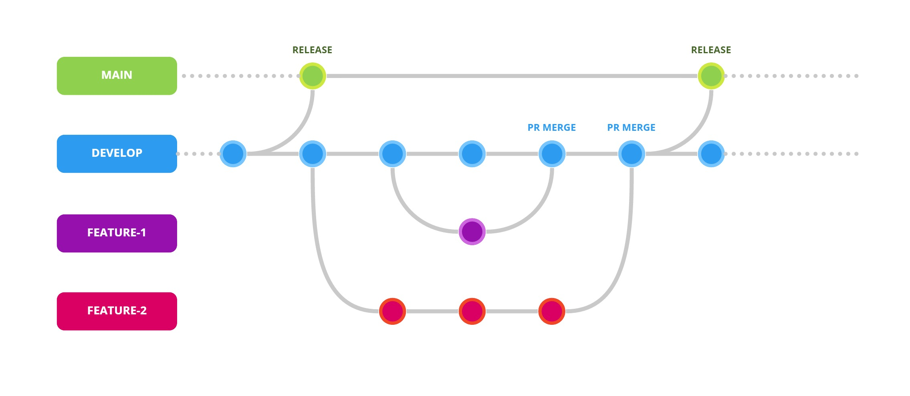
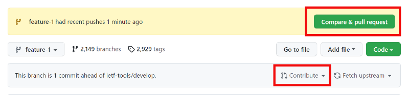
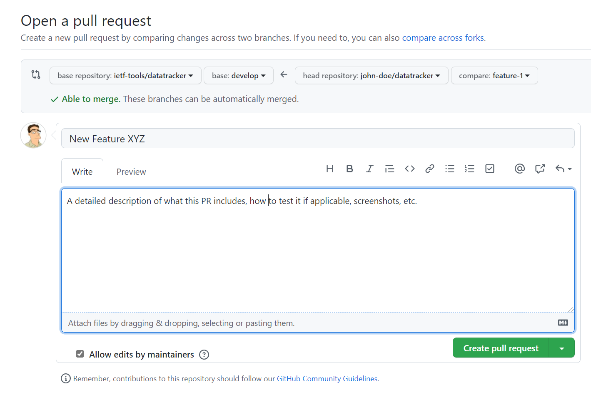
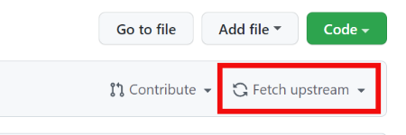

# Contributing to Datatracker

:+1::tada: First off, thanks for taking the time to contribute! :tada::+1:

#### Table Of Contents

- [Workflow Overview](#workflow-overview)
- [Creating a Fork](#creating-a-fork)
- [Cloning a Fork](#cloning-a-fork)
  - [Using Git Command Line](#using-git-command-line)
  - [Using GitHub Desktop / GitKraken](#using-github-desktop--gitkraken)
  - [Using GitHub CLI](#using-github-cli)
- [Create a Local Branch](#create-a-local-branch)
- [Creating a Commit](#creating-a-commit)
  - [From your editor / GUI tool](#from-your-editor-gui--tool)
  - [From the command line](#from-the-command-line)
- [Push Commits](#push-commits)
- [Create a Pull Request](#create-a-pull-request)
- [Sync your Fork](#sync-your-fork)
- [Styleguides](#styleguides)
  - [Git Commit Messages](#git-commit-messages)
  - [Javascript](#javascript)
  - [Python](#python)

## Workflow Overview

The datatracker project uses the **Git Feature Workflow with Develop Branch** model.

It consists of two primary branches:

**Main** - The main branch always reflects a production-ready state. Any push to this branch will trigger a deployment to production. Developers never push code directly to this branch.

**Develop** - The develop branch contains the latest development changes for the next release. This is where new commits are merged.

A typical development workflow:

1. First, [create a fork](#creating-a-fork) of the repository and then [clone the fork](#cloning-a-fork) to your local machine.
2. [Create a new branch](#create-a-local-branch), based on the develop branch, for the feature / fix you are to work on.
3. [Add one or more commits](#creating-a-commit) to this feature/fix branch.
4. [Push the commits](#push-commits) to the remote fork.
5. [Create a pull request (PR)](#create-a-pull-request) to request your feature branch from your fork to be merged to the source repository `develop` branch.
6. The PR is reviewed by the lead developer / other developers, automated tests / checks are run to catch any errors and if accepted, the PR is merged with the `develop` branch.
7. [Fast-forward (sync)](#sync-your-fork) your forked develop branch to include the latest changes made by all developers.
8. Repeat this workflow from step 2.



## Creating a Fork

As a general rule, work is never done directly on the datatracker repository. You instead [create a fork](https://docs.github.com/en/get-started/quickstart/fork-a-repo) of the project. Creating a "fork" is producing a personal copy of the datatracker project. Forks act as a sort of bridge between the original repository and your personal copy.

1. Navigate to https://github.com/ietf-tools/datatracker
2. Click the **Fork** button. *You may be prompted to select where the fork should be created, in which case you should select your personal GitHub account.*


Your personal fork contains all the branches / contents of the original repository as it was at the exact moment you created the fork. You are free to create new branches or modify existing ones on your personal fork, as it won't affect the original repository.

Note that forks live on GitHub and not locally on your personal machine. To get a copy locally, we need to clone the fork...

## Cloning a Fork

Right now, you have a fork of the datatracker repository, but you don't have the files in that repository locally on your computer.

After forking the datatracker repository, you should have landed on your personal forked copy. If that's not the case, make sure you are on the fork (e.g. `john-doe/datatracker` and not the original repository `ietf-tools/datatracker`).

Above the list of files, click the **Code** button. A clone dialog will appear.


There are several ways to clone a repository, depending on your personal preferences. Let's go through them...

> In all cases, you must have **git** installed on your system.

- [Using Git Command Line](#using-git-command-line)
- [Using GitHub Desktop / GitKraken](#using-github-desktop-gitkraken)
- [Using GitHub CLI](#using-github-cli)

### Using Git Command Line

1. Copy the URL in the **Clone with HTTPS** dialog. 
2. In a terminal window, navigate to where you want to work. Subfolders will be created for each project you clone. **DO NOT** create empty folders for projects to be cloned. This is done automatically by git.
3. Type `git clone` and then paste the URL you just copied, e.g.:
```sh
git clone https://github.com/YOUR-USERNAME/datatracker
```
4. Press **Enter**. Your local clone will be created in a subfolder named `datatracker`.

### Using GitHub Desktop / GitKraken

There are several GUI tools which simplify your interaction with git:

- [GitHub Desktop](https://desktop.github.com/) *(macOS / Windows)*
- [GitKraken](https://www.gitkraken.com/) *(Linux / macOS / Windows)*
- [Sourcetree](https://www.sourcetreeapp.com/) *(macOS / Windows)*

If using **GitHub Desktop**, you can simply click **Open with GitHub Desktop** in the clone dialog.

For other tools, you must either manually browse to your forked repository or paste the HTTPS URL from the clone dialog.

### Using GitHub CLI

The GitHub CLI offers tight integration with GitHub.

1. Install the [GitHub CLI](https://cli.github.com/).
2. In a terminal window, navigate to where you want to work. Subfolders will be created for each project you clone. **DO NOT** create empty folders for projects to be cloned. This is done automatically by git.
3. Type `gh repo clone` followed by `YOUR-USERNAME/datatracker` (replacing YOUR-USERNAME with your GitHub username), e.g.:
```sh
gh repo clone john-doe/datatracker
```
4. Press **Enter**. Your local clone will be created in a subfolder named `datatracker`.

## Create a Local Branch

While you could *technically* work directly on the develop branch, it is best practice to create a branch for the feature / fix you are working on. It also makes it much easier to fast-forward your forks develop branch to the match the source repository.

1. From a terminal window, nagivate to the project directory you cloned earlier.
2. First, make sure you are on the `develop` branch.:
```sh
git checkout develop
```
3. Let's create a branch named `feature-1` based on the `develop` branch:
```sh
git checkout -b feature-1
```
4. Press **Enter**. A new branch will be created, being an exact copy of the develop branch.

You are now ready to work on your feature / fix in your favorite editor.

## Creating a Commit

Once you are ready to commit the changes you made to the project code, it's time to stage the modifications.

### From your editor / GUI tool

It's generally easier to use either your editor (assuming it has git capabilities) or using a git GUI tool. This ensures you're not missing any new untracked files. Select the changes / new files you wish to include in the commit, enter a meaningful short description of the change (see [Git Commit Messages](#git-commit-messages) section) and create a commit.

### From the command line

If you wish to use the command line instead, you can view the current state of your local repository using the [git status](https://git-scm.com/docs/git-status) command:
```sh
git status
```

To stage a modification, use the [git add](https://git-scm.com/docs/git-add) command:
```sh
git add some-file.py
```

Finally, create the commit by running the [git commit](https://git-scm.com/docs/git-commit) command:
```sh
git commit
```
This will launch a text editor prompting you for a commit message. Enter a meaningful short description of the change (see [Git Commit Messages](#git-commit-messages) section) and save.

> There are several command parameters you can use to quickly add all modifications or execute several actions at once. Refer to the documentation for each command above.

## Push Commits

You can now push your commits to your forked repository. This will add the commits you created locally to the feature/fix branch on the remote forked repository.

Look for the **Push** button in your editor / GUI tool.

If you prefer to use the command line, you would use the [git push](https://git-scm.com/docs/git-push) command:
```sh
git push origin feature-1
```

> If the feature branch doesn't exist on the remote fork, it will automatically be created.

## Create a Pull Request

When your feature / fix is ready to be merged with the source repository `develop` branch, it's time to create a **Pull Request (PR)**.

On GitHub, navigate to your branch (in your forked repository). A yellow banner will invite you to **Compare & pull request**. You can also click the **Contribute** dropdown to initiate a PR.



Make sure the base repository is set to `ietf-tools/datatracker` with the branch `develop` (this is the destination):



Enter a title and description of what your PR includes and click **Create pull request** when ready.

Your PR will then be reviewed by the lead developer / other developers. Automated tests will also run on your code to catch any potential errors.

Once approved and merged, your changes will appear in the `develop` branch. It's now time to fast-forward your fork to the source repository. This ensures your fork develop branch is in sync with the source develop branch...

## Sync your Fork

Your fork `develop` branch is now behind the source `develop` branch. To fast-forward it to the latest changes, click the **Fetch upstream** button:



Note that you also need to fast-forward your **local machine** `develop` branch. This can again be done quickly from your editor / GUI tool. If you're using the command line, run these commands:

```sh
git checkout develop
git merge --ff-only origin/develop
```

> You can read more about the different ways of pulling the latest changes via [git merge](https://git-scm.com/docs/git-merge), [git pull](https://git-scm.com/docs/git-pull) and [git rebase](https://git-scm.com/docs/git-rebase).

## Styleguides

### Git Commit Messages

* Use the present tense ("Add feature" not "Added feature")
* Use the imperative mood ("Move cursor to..." not "Moves cursor to...")
* Limit the first line to 72 characters or less
* Reference issues and pull requests liberally after the first line
* When only changing documentation, include `[ci skip]` in the commit title
* Consider starting the commit message with one of the following keywords (see [Conventional Commits](https://www.conventionalcommits.org/) specification):
    * `build:` Changes that affect the build system or external dependencies
    * `docs:` Documentation only changes
    * `feat:` A new feature
    * `fix:` A bug fix
    * `perf:` A code change that improves performance
    * `refactor:` A code change that neither fixes a bug nor adds a feature
    * `style:` Changes that do not affect the meaning of the code *(white-space, formatting, missing semi-colons, etc)*
    * `test:` Adding missing tests or correcting existing tests

### Javascript

*TODO*

### Python

*TODO*
